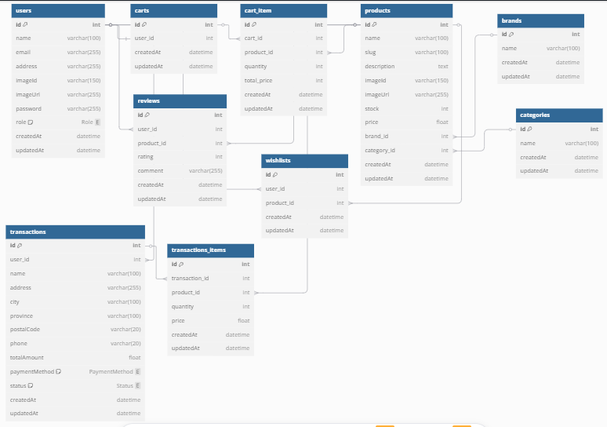

# Marketflow API

## Deskripsi

Ini adalah backend API sederhana untuk aplikasi e-commerce. API ini mendukung fitur seperti pengelolaan produk, keranjang belanja (cart), wishlist, transaksi, serta ulasan produk. Project ini dibangun menggunakan stack modern seperti **Hono**, **TypeScript**, dengan **Prisma** sebagai ORM untuk **PostgreSQL**, serta **Cloudinary** untuk menyimpan gambar produk.

> **Catatan:**
>
> - Dokumentasi API menggunakan **Scalar**, namun **belum tersedia** saat ini.
> - Fitur **Review** masih dalam pengembangan dan belum diimplementasikan dalam API.
> - **Integrasi Payment Gateway** masih dalam pengembangan dan belum diimplementasikan dalam API.

---

## Stack Teknologi

- **Framework**: Hono
- **Bahasa**: TypeScript
- **ORM**: Prisma (PostgreSQL)
- **Validation**: Zod
- **Image Storage**: Cloudinary
- **API Documentation**: Scalar (belum tersedia)

---

## Fitur Utama

- **Authentication & Authorization**: Mengelola user login, register, dan autentikasi.
- **Product Management**: Menambah, memperbarui, dan menghapus produk.
- **Cart Management**: Menambahkan dan mengelola item dalam keranjang belanja.
- **Wishlist**: Menyimpan produk favorit pengguna.
- **Transaction Management**: Membuat dan mengelola transaksi pesanan.
- **Review**: (Fitur belum tersedia) Menambahkan review untuk produk dengan rating dan komentar.
- **Image Upload**: Mengunggah gambar produk menggunakan Cloudinary.

---

## Entity-Relationship Diagram

---

## Dokumentasi API

> **Catatan:** Dokumentasi API menggunakan Scalar, namun belum tersedia saat ini.

---

## Frontend

Marketflow API terhubung dengan [**Marketflow Web**](https://github.com/fathurrahman20/marketflow-web), sebuah aplikasi frontend e-commerce yang dibangun menggunakan React.js dan TypeScript.
